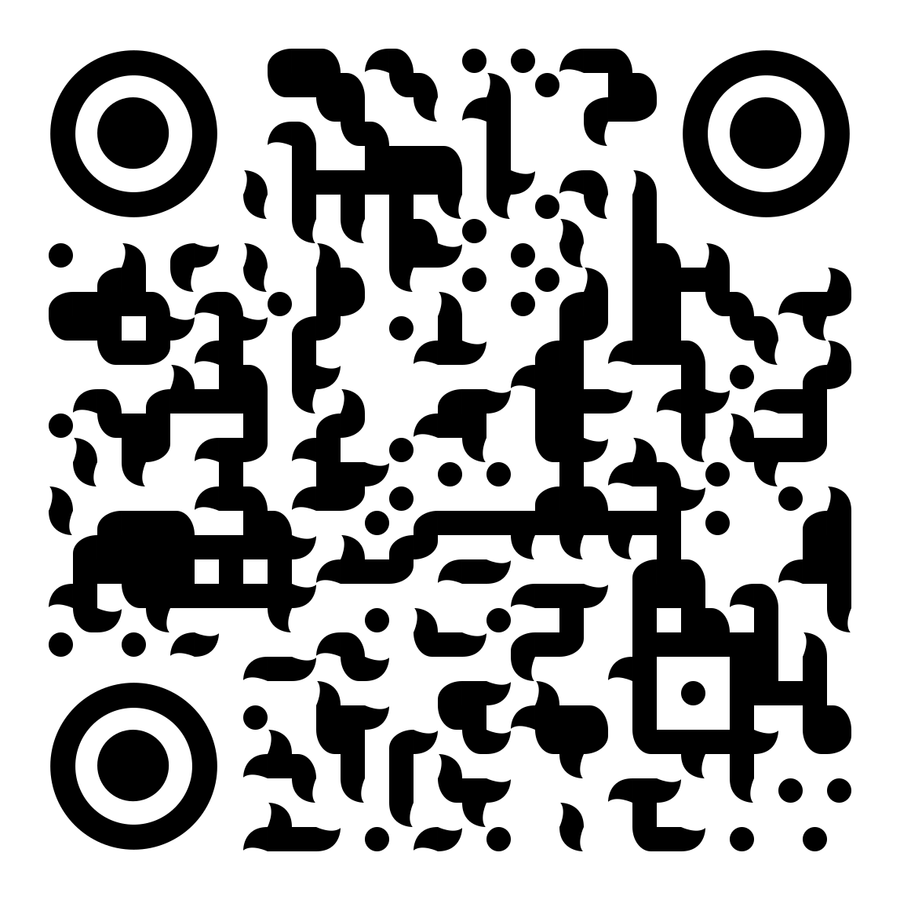

# AR_2024_projects
Some AR projects from 2024 courses made @lecolededesign

# Keith Haring
by Noa Marquet and Edouard Poudat

https://ateliernum.github.io/AR_24_projects/Keith-Haring-AR/

# Jean-Michel Basquiat
by Lou Hervé and Matéo Germain

https://ateliernum.github.io/AR_24_projects/Basquiat/

# Edward Hopper
by Gabriel Linz and Clarisse Dumas

https://ateliernum.github.io/AR_24_projects/Hopper/

# Alfons Mucha
by Agathe Roblin and Clara Salgues

https://ateliernum.github.io/AR_24_projects/Mucha/

# Nam Jun Paik
by Dahyun Kim and Paul Gautier

https://ateliernum.github.io/AR_24_projects/Paik/index.html

# Neri Oxman
by Alexei Nevenchanny and Amandin Guihard

https://ateliernum.github.io/AR_24_projects/oxman/index.html

# Don Norman 
by Clemente Bobillier Ruff and Kaisey Deloso

https://ateliernum.github.io/AR_24_projects/Norman/index.html

# Albrecht Dürer 
by Yujin Kim and Lena Van Maris

https://ateliernum.github.io/AR_24_projects/Durer/index.html

# Paul Rand 
by Léonie morin and Lena Van Maris

https://ateliernum.github.io/AR_24_projects/Rand/AIGA/index.html

https://ateliernum.github.io/AR_24_projects/Rand/LOGOS/index.html

https://ateliernum.github.io/AR_24_projects/Rand/NEXT/index.html

 
<a href="https://ateliernum.github.io/AR_24_projects/Rand/IBM/index.html">https://ateliernum.github.io/AR_24_projects/Rand/IBM/index.html</a>

 
<a href="https://ateliernum.github.io/AR_24_projects/Rand/AIGA/index.html">https://ateliernum.github.io/AR_24_projects/Rand/AIGA/index.html</a>

 
<a href="https://ateliernum.github.io/AR_24_projects/Rand/LOGOS/index.html">https://ateliernum.github.io/AR_24_projects/Rand/LOGOS/index.html</a>

 
<a href="https://ateliernum.github.io/AR_24_projects/Rand/NEXT/index.html">https://ateliernum.github.io/AR_24_projects/Rand/NEXT/index.html</a>

